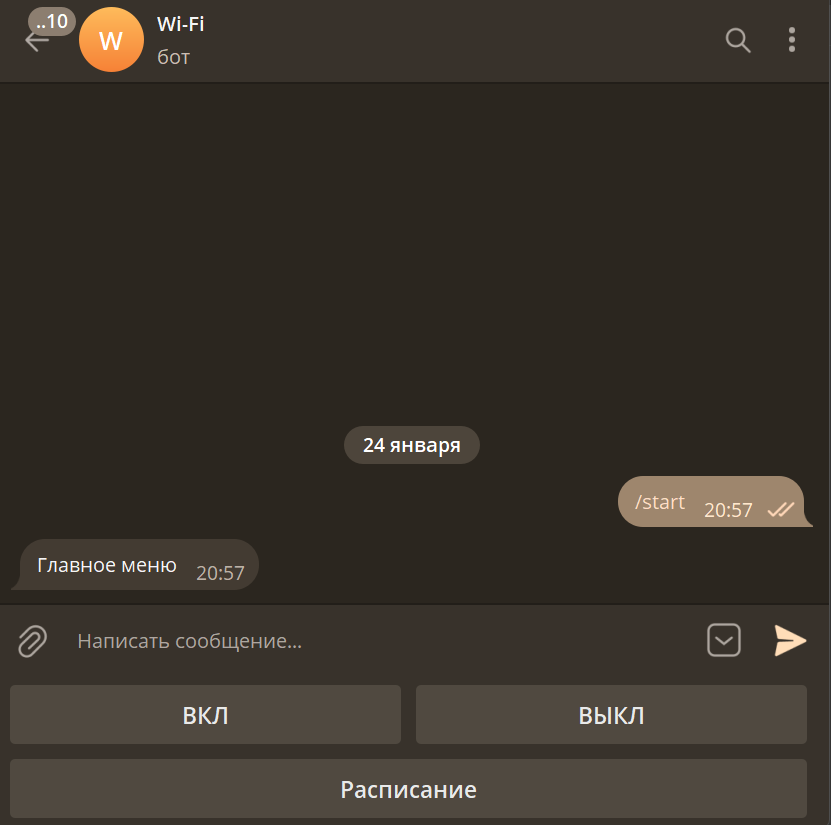
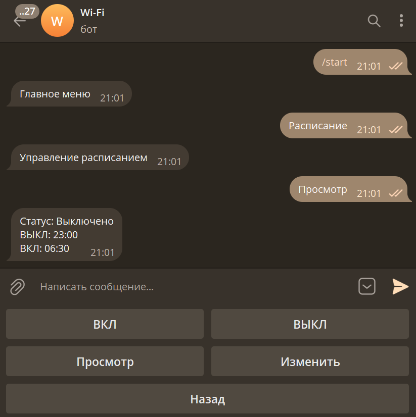

# WiFi Bot

Бот в телеграм для управления беспроводным режимом роутера Wi-CAT Альфин. Бот умеет включать/выключать Wi-FI как по команде, так и по расписанию.

## Скриншоты



## Установка

### ПО 7.5.30 и новее
```
$ ssh Admin@192.168.0.1
# cd /tmp
# wget -O install.sh https://raw.githubusercontent.com/i1mk8/WiFiBot/master/install.sh
# chmod +x install.sh
# ./install.sh
```

### ПО 7.2.x и старее
```
$ ssh Admin@192.168.0.1
# cd /tmp
# wget -O install-legacy.sh https://raw.githubusercontent.com/i1mk8/WiFiBot/master/install-legacy.sh
# chmod +x install-legacy.sh
# ./install-legacy.sh
```

## Сборка
Перед сборкой необходимо изменить [os_linux.go](https://github.com/golang/go/blob/8b23b7b04234424791e26b8d2d26f61ef1311a9f/src/runtime/os_linux.go#L532), добавив `&& sig != 128` в условие на 532 строке.
```
$ go env -w GOOS=linux
$ go env -w GOARCH=mipsle
$ go build -ldflags "-s -w" ./main.go
```
В теории бот должен работать на любых роутерах, главное указать соответствующие архитектуру и интерфейсы в [WiFiManager.go](./src/WiFiManager/WiFiManager.go)
